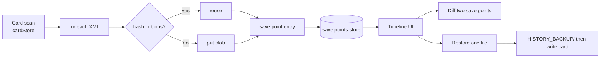

# Plan — `/history`, the 8th tool

**Status:** approved; steps 1-4 of 5 done. Vault storage (real folder on disk) raised as a change of direction — see "Open change" at the bottom.
**Date:** 2026-09-04

## What it is

A memory for the card. Take a save point of every song, kit, and synth patch on the card.
Later, see what changed between any two save points, and put an old version back.

Not Git. No branches, no merges, no remote. One card, one line of history.

## What it is not

| Not this | Why |
|---|---|
| Branches / merges | One person, one card. No value. |
| Remote sync | Needs a server. Breaks the no-upload rule. |
| Sample history | A sample is megabytes. A song is kilobytes. Samples stay out. |
| A replacement for backup | `/manage` backup gets bytes off the card. This answers "what changed?". Both stay. |

## Why it earns its own page

- The verb is different. `/manage` acts on the card **now**. `/history` looks at the card **then**.
- `/manage` (`CardScanner.svelte`) is already 3,400 lines. It must not grow a timeline.
- People reach for this when something broke. It needs a name in the nav, not a hidden tab.

## The part Git cannot do

`git diff` on a Deluge song gives a wall of hex. Useless.

We know what the XML means, so we can show:

```
ACID2.XML   save point 7 -> save point 8
  BPM          128 -> 132
  Track 3      +12 notes
  Track 5      removed
  SYNTH042     cutoff 42 -> 88
```

That is the whole reason to build this instead of using Git.

## Data model

Content-addressed. The same file content is stored once, no matter how many save points hold it.
A save point of an unchanged card costs almost nothing.

```
IndexedDB: "deluge-history", version 1

  store "blobs"      key = hash (sha-256, hex, first 16 chars)
                     value = { xml: string, size: number }

  store "savePoints" key = auto id (keyPath "id")
                     value = {
                       id, cardName, takenAt, label,
                       entries: [ { path, kind, hash, size } ]
                     }
```

`kind` is `"song" | "kit" | "patch"`. Source maps already on `cardStore`:

| kind | source | card path |
|---|---|---|
| song | `cardStore.songXmls` | `SONGS/**/*.XML` |
| kit | `cardStore.presetIndex` | `KITS/**/*.XML` |
| patch | `cardStore.presetIndex` | `SYNTHS/**/*.XML` |

So a save point needs no new card walking. It reads what a scan already loaded.



### Size check

A big card: 300 songs + 200 kits + 300 patches, average 40 KB of XML.
Full save point = ~32 MB **once**. Every later save point only stores files that changed —
typically a handful, so a few hundred KB per save point.

Guards:
- Cap at 50 save points. Prune oldest first, then garbage-collect blobs nothing points at.
- Check `navigator.storage.estimate()` before writing. Warn the user near the limit.
- Offer "export save point as JSON" so history can leave the browser.

## Diff engine — pure TypeScript, no Pyodide

Decision: do **not** call Python for diffs. Reasons: Pyodide costs seconds of load time,
the diff is structural not musical, and note counts are readable straight from the hex.

Two layers:

1. **Structural.** `DOMParser` on both XML strings, walk both trees, emit
   `added | removed | changed` records keyed by an element path
   (`song/instruments/sound[2]@cutoff`).
2. **Friendly.** A lookup table turns known paths into plain words
   (`timePerTimerTick` -> `BPM`, with the tick-to-BPM maths already in `analyzer.py` mirrored
   in TS). Anything unknown falls back to the raw path, so the diff is never wrong, only
   sometimes ugly.

**View-only fields are reported, not dropped.** The Deluge rewrites scroll position, zoom, and
the pad `preview` blob as part of saving. An early cut filtered them out entirely — wrong, and
the user caught it: those writes are real saves, and hiding them would make a diff say
"no changes" about a file that demonstrably changed. They are kept, given real names
("Scroll position", "Pad preview"), flagged `viewOnly: true`, and sorted last.
`musicalChanges()` filters them for the headline; the UI collapses the rest behind a count.

Note counts are cheap and need no decoding: `noteData` is packed hex, 10 bytes per note
(11 for `noteDataWithLift`), so `notes = hexChars / 2 / recordSize`. That gives
"+12 notes" without parsing a single note.

## Restore

Nothing is destroyed, same as the rest of the site.

1. Copy the current file on the card into `HISTORY_BACKUP/<original path>`.
2. Write the old XML over the card file.

Add `HISTORY_BACKUP` to `APP_MANAGED_DIRS` in `cardStore.ts` so it is never scanned or
save-pointed. New function `restoreFile(root, path, xml)` in `softDelete.ts`, next to
`moveToTrash` and `moveFile`, which already do the backup-then-write dance.

Restore is per file. No "restore whole save point" button in v1 — too easy to fire by accident.

## Files

New:

| File | Role |
|---|---|
| `web/src/lib/historyStore.ts` | IndexedDB store: hash, save point, list, load, delete, prune, GC, export |
| `web/src/lib/historyStore.test.ts` | tests (fake-indexeddb) |
| `web/src/lib/xmlDiff.ts` | structural XML diff + friendly labels + note counts |
| `web/src/lib/xmlDiff.test.ts` | tests, `test.each` over fixture pairs |
| `web/src/components/HistoryTimeline.svelte` | the tool |
| `web/src/components/HistoryTimeline.test.ts` | component test |
| `web/src/pages/history.astro` | page shell |

Changed:

| File | Change |
|---|---|
| `web/src/lib/cardStore.ts` | add `HISTORY_BACKUP` to `APP_MANAGED_DIRS` |
| `web/src/lib/softDelete.ts` | add `restoreFile()` |
| `web/src/layouts/BaseLayout.astro` | nav link; tool-route list for `tool_visit` grows 7 -> 8 |
| `web/src/components/CardScanner.svelte` | link to `/history` next to backup |
| `web/src/components/SongAnalyzer.svelte` | per-song "history" link |
| `web/src/components/KitBuilder.svelte`, `PatchGenerator.svelte` | same, later |
| `CLAUDE.md` | pages table, lib table, IndexedDB note, analytics table |

## UI sketch

```
+-- /history -------------------------------------------------+
| [ Take save point ]      card: DELUGE       12 save points       |
+---------------------+---------------------------------------+
| Sep 04  14:22  #12  |  #11 -> #12                            |
| Sep 04  09:10  #11  |                                        |
| Sep 03  20:45  #10  |  SONGS/ACID2.XML        changed        |
| Sep 01  11:02  #9   |    BPM      128 -> 132                 |
| ...                 |    Track 3  +12 notes                  |
|                     |    [ restore this version ]            |
|                     |                                        |
|                     |  KITS/BREAKS.XML        added          |
|                     |  SYNTHS/PAD03.XML       removed        |
+---------------------+---------------------------------------+
```

Pick one save point to see it against the one before. Pick two to compare directly.
Filter by kind (song / kit / patch).

## Build order — one testable step each, stop for review between

1. ~~**`historyStore.ts` + tests.**~~ **DONE (2026-09-04)** — 40 tests, 100% lines.
   `SavePoint`/`SaveEntry`/`CardSource` types, `hashXml()` (SHA-256, 16 hex chars),
   `classifyPath()`, `createSavePoint`, `listSavePoints`, `getXml`, `deleteSavePoint`,
   `exportSavePoint`, `estimateUsage`, `blobCount`, `clear`, 50-cap prune + blob GC.
   Added `fake-indexeddb` as a dev dependency (the hand-rolled fake in `cardStore.test.ts`
   cannot do autoincrement keys or `getAll`). Default label is a date, not an id, because
   autoincrement ids never reset and would read "Save point 137" after a prune.
2. ~~**`xmlDiff.ts` + tests.**~~ **DONE (2026-09-04)** — 43 tests, 100% lines.
   `diffXml`, `musicalChanges`, `compareSavePoints`, `readBpm`, `countNotes`. BPM is
   collapsed from the two raw tick fields into one line; note counts are aggregated per clip
   ("Clip 2 notes: +3 notes"); view-only fields are flagged, not dropped. Verified against
   the real `tests/fixtures/square_spelunking.XML`: a song against itself yields zero changes,
   and a tempo-only edit yields exactly one line.
3. ~~**`restoreFile()` + `HISTORY_BACKUP`**~~ **DONE (2026-09-04)** — 13 tests, `softDelete.ts`
   at 100%. Backs the current file up before writing, refuses to write into any app-managed
   folder, recreates a file deleted off the card, and never overwrites an existing backup
   (second restore lands at `NAME.XML.1`). `HISTORY_BACKUP` added to `APP_MANAGED_DIRS`.
4. ~~**`/history` page + `HistoryTimeline.svelte`**~~ **DONE (2026-09-04)** — 40 tests,
   100% lines on the component, `npm run build` clean (zero errors, zero warnings).
   Timeline, per-file diff, per-file restore, kind filter, compare-any-two, delete, export,
   storage warning, **Reset card**. Nav link and the `/history` analytics route added.
5. **Cross-links, nav, analytics, `CLAUDE.md`.**

## Analytics

New row in the `tool_action` table:

| Tool | Actions |
|---|---|
| `history` | `save_point` (+files/changed), `diff`, `restore`, `prune`, `export_save_point` |

Not tracked: scrolling the timeline, expanding one diff row. Too noisy for the free tier.

## Risks

| Risk | Handling |
|---|---|
| IndexedDB quota blows up | 50-save point cap, `storage.estimate()` warning, JSON export |
| Restore writes the wrong file | `HISTORY_BACKUP` copy first; per-file only, no bulk restore |
| Diff shows raw XML paths for unknown fields | Accepted. Correct but ugly beats pretty but wrong |
| Save point needs a fresh card scan | Reuse `cardStore` maps; prompt to reconnect if not loaded |
| Firefox / Safari | Save point and diff work read-only via drag-drop. Restore needs Chromium, same as every other write feature |

## Answered (2026-09-04)

1. **By hand only** to start. A button, no automatic capture on `/manage` scan. Revisit later.
2. **Whole card XML set** per save point, always. Content addressing makes the disk cost
   near identical, and every save point stays readable as a complete card state.
3. Called a **"save point"**, not a save point — plainer, and it fits the Quest theme.
   `SavePoint` in code too, so the words match end to end. The page stays `/history`.

## Comparing two backup folders

**Reset card** (added 2026-09-04, user request) drops the current card and reopens the picker.
Save points already taken are kept, so the flow is:

1. Point at `BACKUP-2025-12`, take a save point.
2. Reset card, point at `BACKUP-2026-01`, take another.
3. Compare the two.

Each save point records the folder it came from and shows it in the timeline. When the two
sides of a diff came from different folders, the view says so, and warns that paths are matched
by name — anything renamed between the two reads as one removed and one added, not a rename.

## Open change — a vault folder on disk (raised 2026-09-04)

The user's objection to browser-only storage: save points that live in IndexedDB are not
useful, and export-to-JSON is not the experience wanted. Fair — clearing site data loses
everything, and nothing is visible to the rest of the machine.

Fix: let the user pick a **vault folder** with `showDirectoryPicker()` and write save points
there as real files, the same way the card handle is already picked and persisted.

```
<vault>/
  blobs/<hash>.xml          content-addressed, shared across save points
  save-points/0007.json     { id, label, takenAt, cardName, entries[] }
```

Same content addressing, so an unchanged file still costs nothing. The folder is plain files:
back it up, sync it, put it in Git, read it without the site.

Chromium-only, exactly like every other write feature here. Browser storage stays as the
fallback when no folder is picked.
