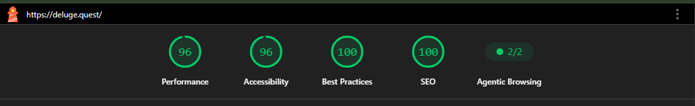

## Feature Inventory

I've put a lot of work into this site!

Almost every page has something one can do without *requiring* owning a Deluge or using one's personal files:

* [Homepage](/): play audio, use DelugeUI's knobs to change audio
* [Card Management](/manage): Links to factory card for testing. (I don't own this data and it's also quite large, so I chose to not self-host it here as a default.)
* [Song Stats](/stats): I've chosen seven sample songs one could test this feature with, using a variety of keys, settings, instruments, etc.
* [Song Preview](/preview): I've added my transcription of the first Brahms cello sonata as a default option for testing this feature.
* [Score Converter](/score): The Brahms cello sonata is pre-loaded here as well.
* [Kit Builder](/kits): Until the user loads in their own samples, there's a WebAudio-derived "808" kit to play with in the sequencer here, with a default pattern to get folks started.
* [Patch Generator](/patch): There's a `Preview` button on the patch generator to get an *approximation* of what the patch might sound like on the Deluge.
* [MIDI Import](/import): There's no default here. Even pre-loading a MIDI file just outputs an XML, not a very interesting experience. I was able to play "Bohemian Rhapsody" from [bitmidi.com](https://bitmidi.com/queen-bohemian-rhapsody-mid) on my Deluge yesterday, and that wasy pretty cool, I must say.
* [Card Backup](/backup): This is CLI documentation, so there won't be anything to do here except read the docs, but docs are awesome, so that's quite a treat imo.
* [FAQ](/faq): Another reading page, but more focused on the site itself rather than a particular tool.
* [Songs](/songs): This is a selection of 100%-Deluge-produced tracks I've made over the last seven years, with knobs to turn as you listen. All of this is hooked into the system player, so you can hit Play/Pause/Next/Previous on your keyboard, and the music keeps playing as you navigate to other pages of the site, with a status bar with a pause button at the top of each page.
* [Changelog](/changelog): You're reading this page now, hopefully its purpose is self-evident!

I've tested every tool on this site with my own files and am feeling rather chuffed about the experience. I'm more driven to make music on my Deluge thanks to a better organized, better understood SD card.

## Quality Controls

I've put a remarkable amount of work into code quality and test coverage. This site features Python (compiled to WebAssembly via Pyodide), TypeScript, and Svelte components. `just check` runs linting and tests on *everything*:

```console
$ just check
...
─── Summary ───
✓ ruff check
✓ pyright
✓ pytest
✓ biome lint
✓ svelte-check
✓ vitest

All checks passed.
  48.674s
```

`just coverage` runs three different test suites and stitches their coverage levels together into a final report. I can't deny that I really want 90%+ in all three categories, but the untested branches in particular have some pretty tricky logic to substantially increase coverage from here.

```console
❯ just coverage

=== Test suites ===
Python:  ============================= 428 passed in 30.64s =============================
Web:           Tests  743 passed (743)
Pyodide:       Tests  6 passed (6)
(pass --verbose for full per-suite coverage tables)

=== Combined coverage by file ===
Reading tracefile coverage/merged.lcov
                                        |Lines       |Functions  |Branches
Filename                                |Rate     Num|Rate    Num|Rate     Num
==============================================================================
[deluge_tools/]
analyzer.py                             | 100%     56| 100%     3| 100%     12
bridges.py                              | 100%    110| 100%     7|95.2%     42
card_scanner.py                         |94.2%    120| 100%     8|89.1%     46
cli.py                                  |98.8%     85| 100%     3|97.2%     36
cli_backup.py                           |84.5%    367|96.7%    30|66.3%     98
cli_clean.py                            |99.2%    118| 100%     7|98.4%     62
cli_import.py                           |96.2%     26| 100%     1|83.3%      6
cli_quest.py                            |93.3%     15| 100%     1|75.0%      4
cli_stats.py                            |98.6%    138| 100%     9|96.3%     54
converter.py                            | 100%    191| 100%     8|99.0%    100
filesync.py                             |77.8%     81|80.0%     5|69.6%     46
midi_to_deluge.py                       |98.9%    174| 100%    10|97.8%     46
musicxml_writer.py                      |97.6%    330| 100%    14|90.2%    164
parser.py                               |98.6%    278| 100%    17|89.7%     58

[web/src/]
components/CardScanner.svelte           |87.6%   1078|80.9%   304|66.7%    601
components/DelugeUI.svelte              |97.5%    473|98.1%   104|83.1%    231
components/KitBuilder.svelte            |80.9%    802|76.4%   144|70.0%    507
components/MidiImporter.svelte          |97.5%     79|92.9%    14|85.3%     34
components/PatchGenerator.svelte        |99.3%    289|97.7%    44|85.8%    219
components/ScoreConverter.svelte        |95.8%    168|95.2%    42|81.1%     90
components/SongAnalyzer.svelte          |85.1%    679|76.8%   228|76.2%    407
components/SongPlayer.svelte            |90.1%     81|90.0%    20|68.4%     38
components/SongPreview.svelte           |93.9%    456|96.0%   126|77.6%    277
lib/analytics.ts                        | 100%     15| 100%     8| 100%     16
lib/audioVisualizer.ts                  | 100%    283| 100%    21|93.3%     90
lib/cardStore.ts                        | 100%    184|86.7%    45|91.2%     80
lib/channelLabels.ts                    | 100%     20| 100%     5| 100%     10
lib/demoSong.ts                         | 100%     10| 100%     3| 100%      4
lib/drumSynth.ts                        | 100%    164| 100%    13|    -      0
lib/homeAudio.ts                        | 100%    247| 100%    46|90.8%    119
lib/kitXml.ts                           |98.6%     73| 100%    15|87.3%     63
lib/padSounds.ts                        | 100%    177| 100%    17| 100%      4
lib/patchAudio.ts                       |97.3%    264|92.0%    25|89.5%     76
lib/pyodide.ts                          |55.6%     36|66.7%     6|25.0%      8
lib/screenGuard.ts                      | 100%      1| 100%     1| 100%      4
lib/sequencerAudio.ts                   |98.5%    132| 100%    33|87.5%     48
lib/softDelete.ts                       | 100%     48| 100%     5| 100%      8
lib/songAudio.ts                        |99.6%    486|98.1%    53|88.6%    166
==============================================================================
                                  Total:|93.1%   8334|88.2%  1445|80.1%   3874

deluge_tools/  lines  95.1%  functions  98.4%  branches  89.1%
web/src/       lines  92.4%  functions  87.2%  branches  77.9%

=== Combined coverage ===
Summary coverage rate:
  lines......: 93.1% (7757 of 8334 lines)
  functions..: 88.2% (1274 of 1445 functions)
  branches...: 80.1% (3104 of 3874 branches)

Full report: coverage/html/index.html
  32.010s
```

With the commit including this changelog, I've been adding niceties that subtly rather than explicitly improve the site:

* An RSS feed on the changelog for those who want to follow
* Self-hosted fonts rather than pointing at the Google CDN
* A tri-modal theme toggle (as opposed to only following the system theme)

Finally, I made a few improvements to push my [Lighthouse](https://developer.chrome.com/docs/lighthouse) report to all green:



Again, I *really* want to push this to all 100, but as the saying goes: [practicality beats purity](https://peps.python.org/pep-0020/).

In this case, I'm losing some accessibility points because some of the DelugeUI's pads are too small on mobile. This seems acceptable to me: these pads are essentially just a toy/demo, not crucial to the site's tools. I think having a small DelugeUI on mobile beats a "please rotate phone to landscape" or a different mobile view altogether.

On the performance end, I'm torn. On one hand, I want 100. On the other, the solution here seems to be maintaining two different versions of the DelugeUI: one in HTML/CSS for faster pageload, then the other in my Svelte island to hydrate the functionality. I... am allergic to maintaining two copies of the same thing. I'm declaring 96 a perfect score for a site of this nature!

The perfectionist in me is truly running out of things to test, shore up, or otherwise improve. The main thing left to do for this site is... share it? As someone who tends toward "lurker", this is easier said than done.
